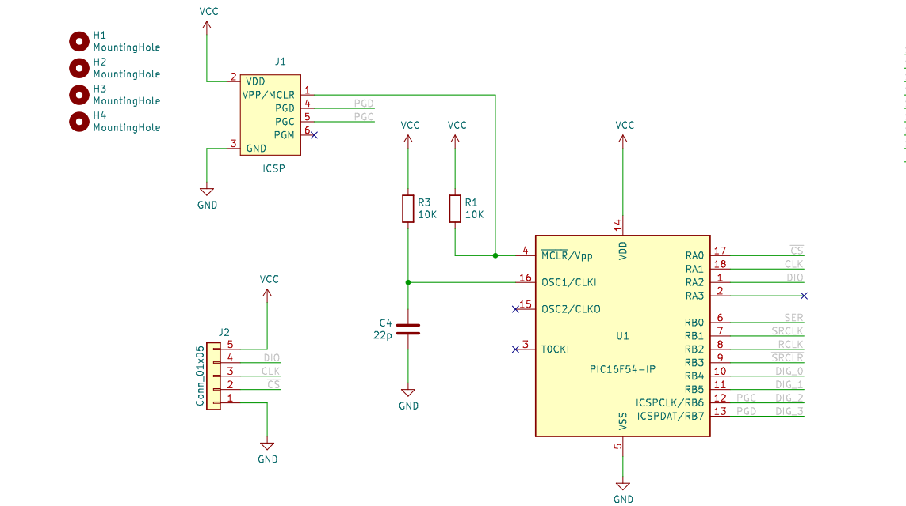
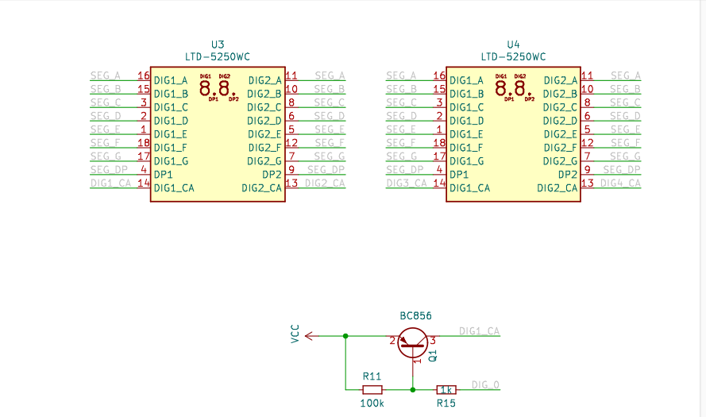
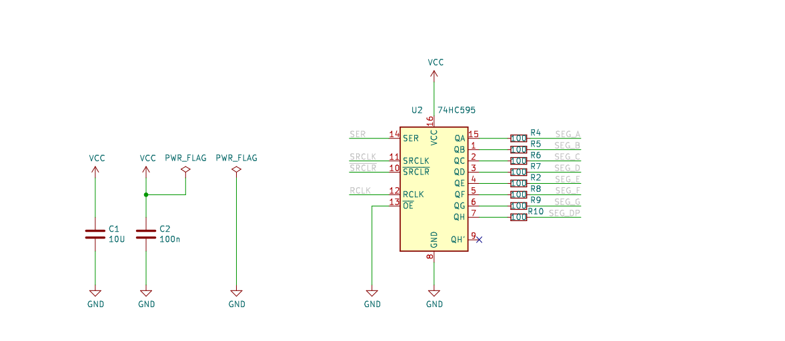
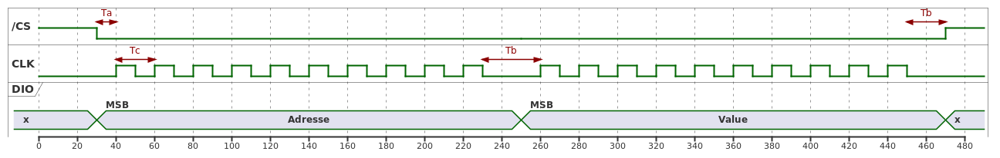
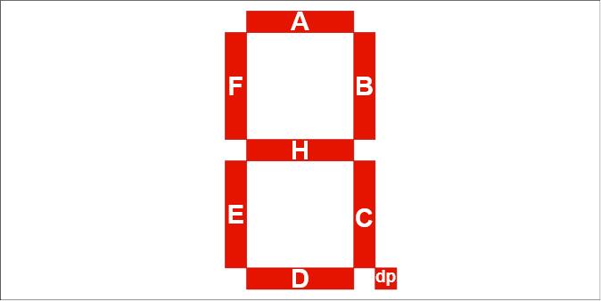

# LTD5250_4digit_asm
 
# Overview

A controller to drive a 4 digits 7 segments display over SPI bus. The controller can set up the luminosity and shut-down the display.  

The "PIC16F54 7 segments display":

- 2 x LTD5250 2 Digits
- 1 x PIC16F54 Micro-Controller
- 1 x 74HC595 Shift Register
- 4 x 2N7002 Transistors

# Features

- SPI bus
- Disable/Enable
- Dimming
- 4 characters

# Schematic

The schematic[^schematic] and the gerber[^gerber] files

[^gerber]: documents/gerber.zip
[^schematic]: documents/images/ltd5250-schematic.pdf

# SPI Protocol

## Byte Timing

Address
: 1.Byte of the command, determines which register to be updated.

Value
: 2.Byte of the command, the value to be updated.

Table: Bit Timing

| Symbol | Description | Min | Typ | Max | Unit |
|:--:|:---|:---|:---:|---:|---:|
| Ta | Enable | 144 | 450 | 360 | us |
| Tb | Time to read | 380 | 500 | 720 | us |
| Tc | Time to new bit | 144| 1500 | 7500 | us |
| Td | Time to new bit | 144| 1500 | 7500 | us |

Ta
: Start of new bit

Tb
: Time between start of EN and the remote sample the DIO

Tc
: Time the remote spend wait for new Data, this should be bigger than the minimum allowed time for EN

Td
: Time the remote spend wait for new Data, this should be bigger than the minimum allowed time for EN

## Registers

Table: Driver Registers

| Adresse | Description | Default |
|:--------|:-----------:|--------:|
| 0x00    |   Option    | 0x00 |
| 0x01    |   Digit 1   | 0x00 |
| 0x02    |   Digit 2   | 0x00 |
| 0x03    |   Digit 3   | 0x00 |
| 0x04    |   Digit 4   | 0x00 |

### Option Register Bit Assignement

This register acts as setting register.

Table: Option Register 

| Option       | 7 | 6 | 5 | 4 | 3 | 2 | 1 | 0 |
|:-------------|:-----:|:-----:|:-----:|:-----:|:-----:|:-----:|:-----:|:-----:|
| Description  | SLEEP | <t style="text-decoration:overline">EN</t> | DIM5  | DIM4  | DIM3  | DIM2  | DIM1  | DIM0  |
| Default      | 0 | 0 | 0 | 0 | 0 | 0 | 0 | 0 |

DIM<5-0>
: Dimmer, '0b000000' is full power and '0b111111' is dark.

<t style="text-decoration:overline">EN</t>
: Writing '1' to this position will power off the segments. All segments are off, but the controller is still running.
 
SLEEP
: The controller go in sleep. Can only be restart push the <t style="text-decoration:overline">MCLR</t> pin down. All registers will be reset to theirs default value. 

<!--  -->

### Digit x Register Bit Assignement

Registers describing the segments that should light on. Writing '1' to a position will light on this segments. 

Table: Digit Register Bit Assignement

| Bit 7 | Bit 6 | Bit 5 | Bit 4 | Bit 3 | Bit 2 | Bit 1 | Bit 0 |
|:-----:|:-----:|:-----:|:-----:|:-----:|:-----:|:-----:|:-----:|
| DP    | G     | F  | E | D | C | B | A |

