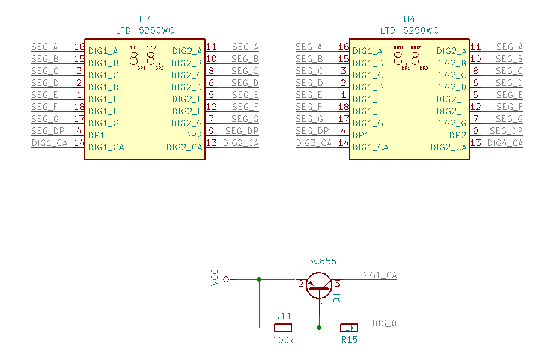
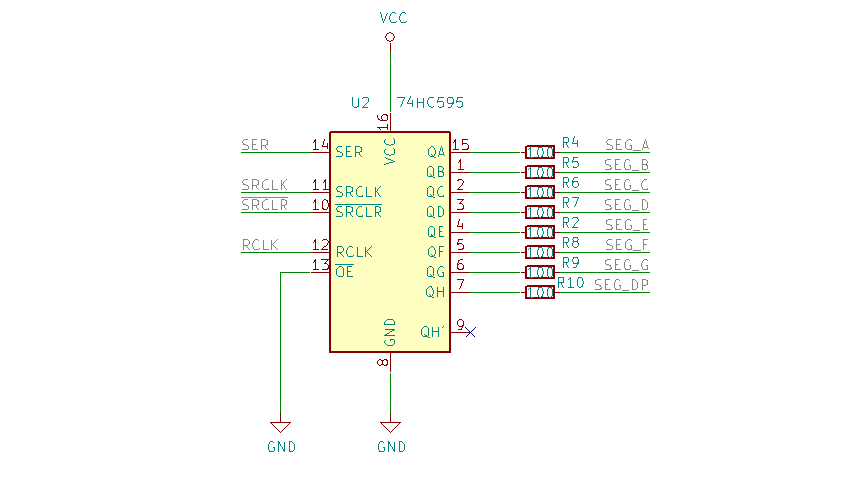
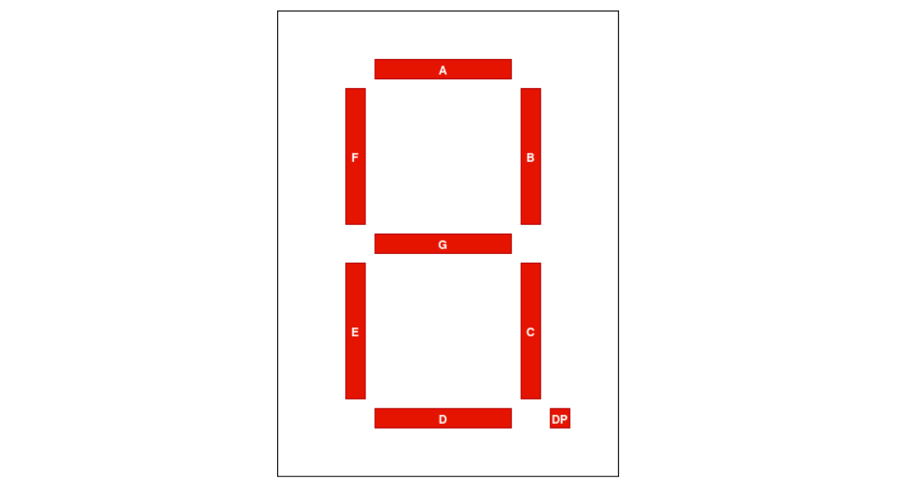
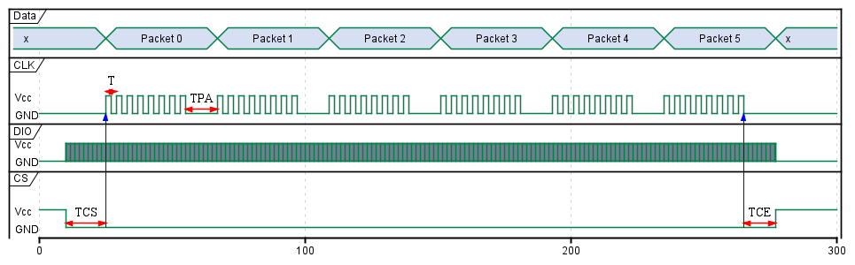

 
# Overview

A controller to drive a 4 digits 7 segments display over SPI bus. The controller can set up the luminosity and shut-down the display.  

The components":

- 2 x 2 digits 7 segments common anode (LTD 5250WD)
- 1 x PIC16F54 Micro-Controller
- 1 x  74HC595 shift register
- 4 x 2N7002 Transistors

# Features

- SPI bus
- Disable/Enable
- Dimming
- 4 characters

# Schematic

The schematic[^schematic] and the gerber[^gerber] files

[^gerber]: documents/gerber.zip
[^schematic]: documents/images/ltd5250_pic16f54_sch.pdf

<figcaption>

</figcaption>

<figcaption>

</figcaption>

<figcaption>

</figcaption>

# SPI Protocol

## Intern Register

Table: Intern Register Structure

| Adresse | Description |
|:---:|:---|
| 0x00   | Config Register  |
| 0x01   | Digit 1 Register |
| 0x02   | Digit 2 Register |
| 0x03   | Digit 3 Register |
| 0x04   | Digit 4 Register |

### Register 0x00 - Config Register

Table: Config Register 

|__Bit__  |   7   |   6   |   5   |   4   |   3    |   2    |   1    |   0   |
|:---      |:-----:|:-----:|:-----:|:-----:|:------:|:------:|:------:|:-----:| 
|__0x00__  |   -   |   -   |   -   |  EN   |  DIM3  |  DIM2  |  DIM1  |  DIM0 | 
|__Initial value__  | &nbsp; &nbsp; 0 &nbsp; &nbsp; | &nbsp; &nbsp; 0 &nbsp; &nbsp; | &nbsp; &nbsp; 0 &nbsp; &nbsp;  |   0   |   1    |   0    |   0    |   0   |

DIM[3-0]
:  Dimming (0x0 = Maximal and 0xF = Minimal)

EN
: Enable / Disable (1 = Disable 0 = Enable)

### Register 0x01-0x04 - Digit Register

Each bit in those registers represents a segment.

Table: Digit Register 

| __Bit__           |  7   |  6   |  5   |  4   |  3   |  2   |  1   |  0  |
|:---               |:---: |:---: |:---: |:---: |:---: |:---: |:---: |:---:|
|__0x01-0x04__      | dp   |  G   |  F   |  E   |  D   |  C   |  B   |  A  |
|__Initial value__  | &nbsp; &nbsp; - &nbsp; | &nbsp; &nbsp; - &nbsp; | &nbsp; &nbsp; - &nbsp; | &nbsp; &nbsp; - &nbsp; | &nbsp; &nbsp; - &nbsp; | &nbsp; &nbsp; - &nbsp; | &nbsp; &nbsp; - &nbsp; | &nbsp; &nbsp; - &nbsp; &nbsp; |

<figcaption>

</figcaption>

Table: Digit Register 

| Adresse | Description | Initial value |
|:---:|:---:|:---:|
| 1   | Digit 1 Register | 0x01 |
| 2   | Digit 2 Register | 0x03 |
| 3   | Digit 3 Register | 0x07 |
| 4   | Digit 4 Register | 0x0F |

## SPI Datagramme

<figcaption>

 

</figcaption>

The value in _Packet 0_ sets the register to start with. After the Packet is received the adresse of the register is set or incremented. _Packet 0_ should have values 0 to 4. For another value in the _Packet 0_ the datagramme is ignored. When the incremented adresse is bigger than 4 the following packets are ignored. 

Table: Bit Timing

| Symbol | Description | Min | Typ | Max | Unit |
|:---:|:---|:---|:---:|---:|---:|
| T | Clock period | 144 | 450 | 360 | us |
| TCS | Wait after CS enable | 380 | 500 | 720 | us |
| TCE | Wait before CS disable | 144| 1500 | 7500 | us |
| TPA | Wait between packet | 144| 1500 | 7500 | us |

